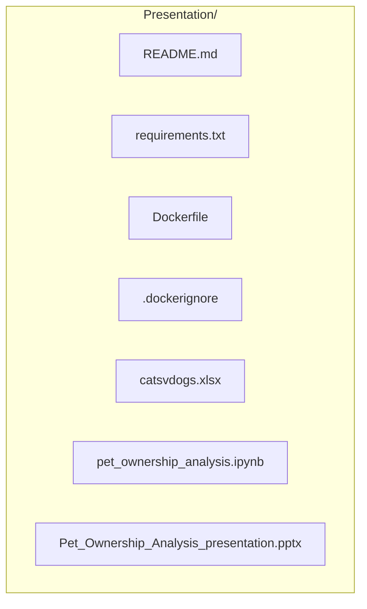
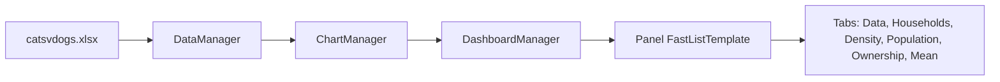

# Project Files Diagram

## Repository structure

## File roles

| File | Role |
|------|------|
| `README.md` | Docs, Hugging Face metadata, tech stack, chart list, live demo link |
| `requirements.txt` | Python deps: numpy, pandas, matplotlib, seaborn, pywaffle, plotly, panel, openpyxl |
| `Dockerfile` | Docker image for dashboard |
| `.dockerignore` | Docker build exclusions |
| `catsvdogs.xlsx` | Input data (state-level pet/household stats) |
| `pet_ownership_analysis.ipynb` | Dashboard notebook (data → charts → Panel UI) |
| `Pet_Ownership_Analysis_presentation.pptx` | Presentation slides |

## Notebook flow

